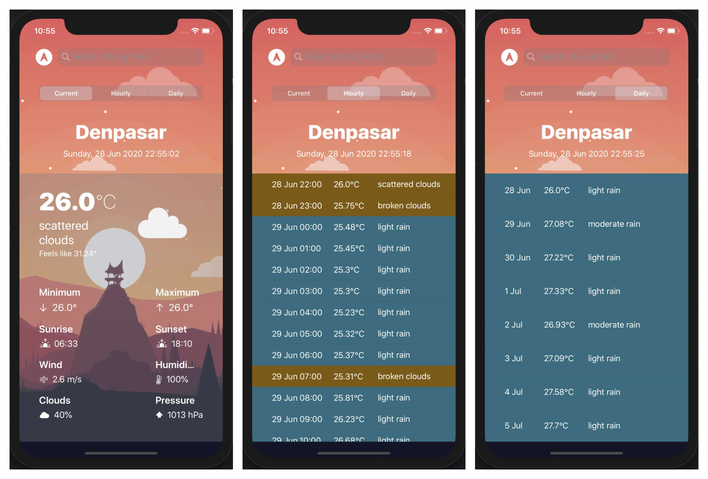

# WEATHERIA

- Swift version: 5.2
- iOS version: 13.5
- For now, the UI only applied to iPhone 11 

This is only for educational purpose. This is my first project after 20 hours learning iOS dev. Readme will be updated later.

What is Weatheria? Weatheria is an app to see weather forecast. We deliver current weather, hourly forecast, and daily forecast.

MVP:
1. v0.1.0 (finished)
  - User can see current weather with complete information
  - When first boot up, the area shown is current location
  - User can search for the city
  - User can tap on location button to look at current location weather forecast
  - User can see the City Name with the date, day, and clock
2. v0.2.0 (finished)
  - User can see hourly and daily forecast
  - Testing negative case
  - Doing some UI change
3. v0.3.0 
  - Change the controllers
  - Change the logic architecture
  - User can see details of hourly and daily forecast;
4. v0.4.0 
  - User can change the unit to celcius or fahrenheit;
5. v.0.5.0
  - Change the UI significantly;
6. v0.6.0 and up
  - (no clue)
